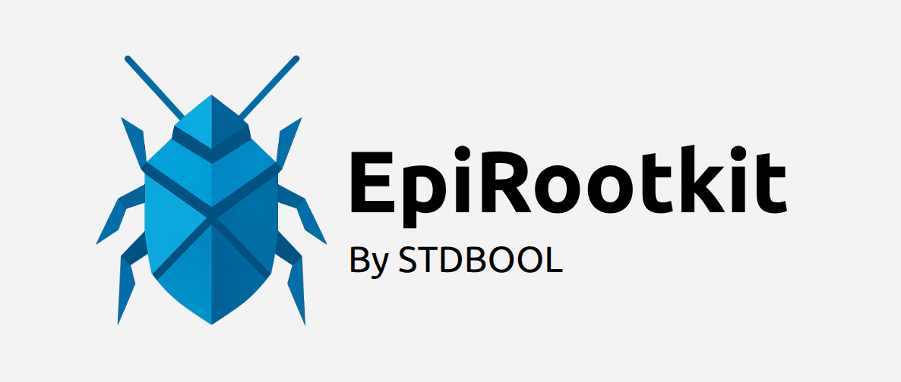

# Overview

\htmlonly

\endhtmlonly
    

## 1. Introduction

Bienvenue dans le projet **EpiRootkit**, un rootkit pédagogique développé dans le cadre de notre cursus à EPITA. Ce rootkit s’insère au niveau noyau pour offrir un canal de commande et de contrôle (C2) hybride, combinant une communication classique par TCP ainsi qu'une communication furtive par requêtes DNS. Les membres du groupes sont **Thibault Colcomb**, **Oleg Krajic** et **Evann Marrel**.

## 2. Architecture

```
.
├── crypto
│   ├── aes.c
│   ├── crypto.h
│   └── hash.c
├── include
│   ├── config.h
│   ├── epirootkit.h
│   ├── rootkit_command.h
│   └── socat.h
├── interceptor
│   ├── core
│   │   ├── include
│   │   │   ├── ftrace.h
│   │   │   ├── init.h
│   │   │   └── menu.h
│   │   ├── array.c
│   │   ├── ftrace.c
│   │   ├── init.c
│   │   └── menu.c
│   ├── hooks
│   │   ├── alterate
│   │   │   ├── alterate.c
│   │   │   ├── alterate.h
│   │   │   └── list.c
│   │   ├── forbid
│   │   │   ├── forbid.c
│   │   │   ├── forbid.h
│   │   │   └── list.c
│   │   └── hide
│   │       ├── hide.c
│   │       ├── hide.h
│   │       └── list.c
│   └── misc
│       └── ghost.c
├── network
│   ├── core
│   │   ├── network.c
│   │   └── network.h
│   └── protocols
│       ├── dns
│       │   ├── dns.c
│       │   └── worker.c
│       └── tcp
│           ├── socket.c
│           └── worker.c
├── scripts
│   ├── format.sh
│   └── generate_socat_h.sh
├── epikeylog.c
├── exec_cmd.c
├── file_ops.c
├── main.c
├── Makefile
├── rootkit_command.c
├── socat
└── socat.c
```